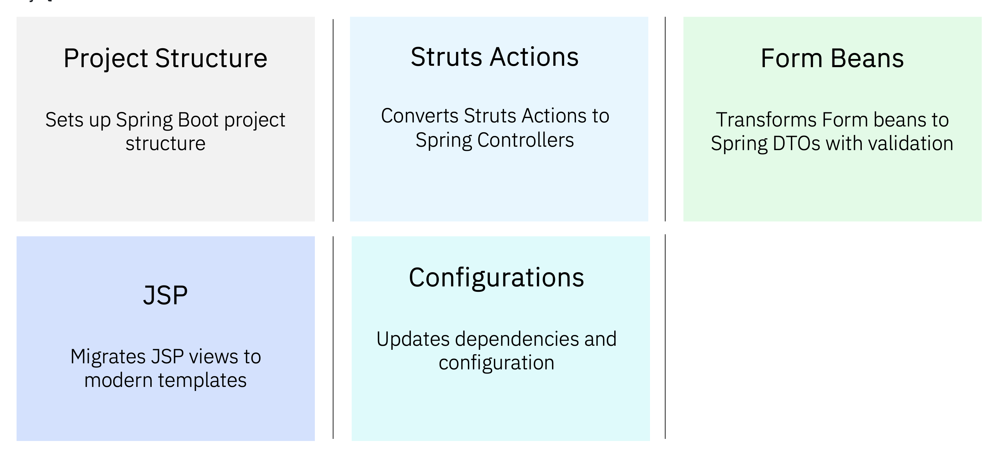
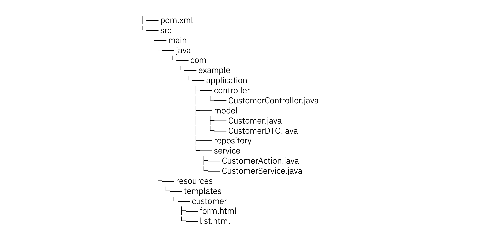
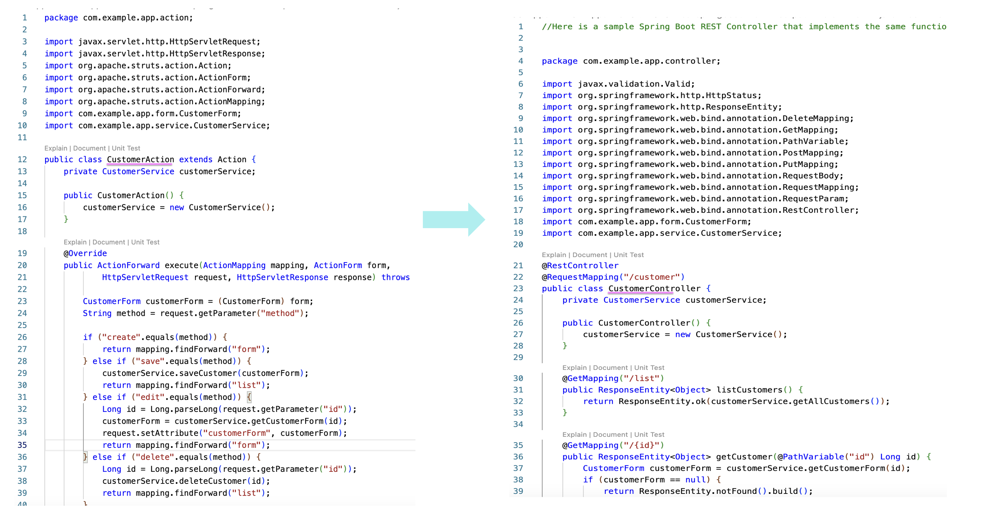
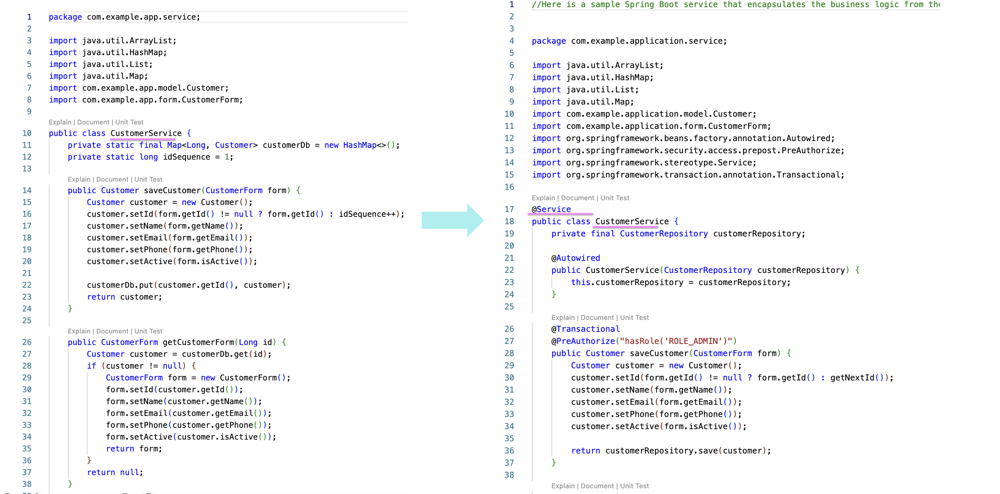
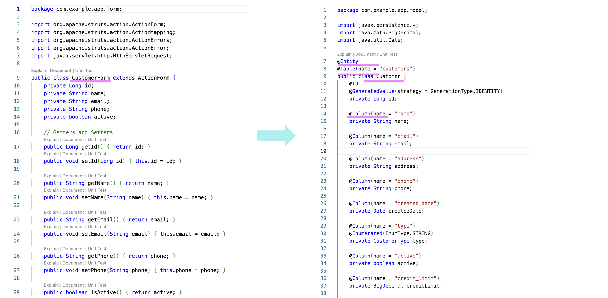
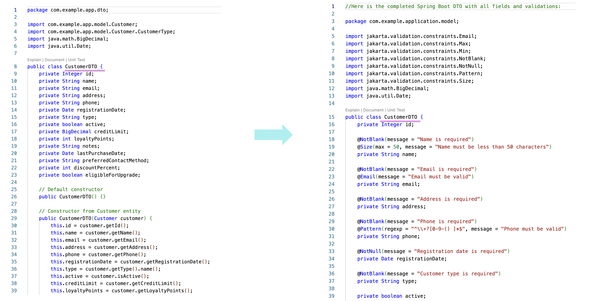
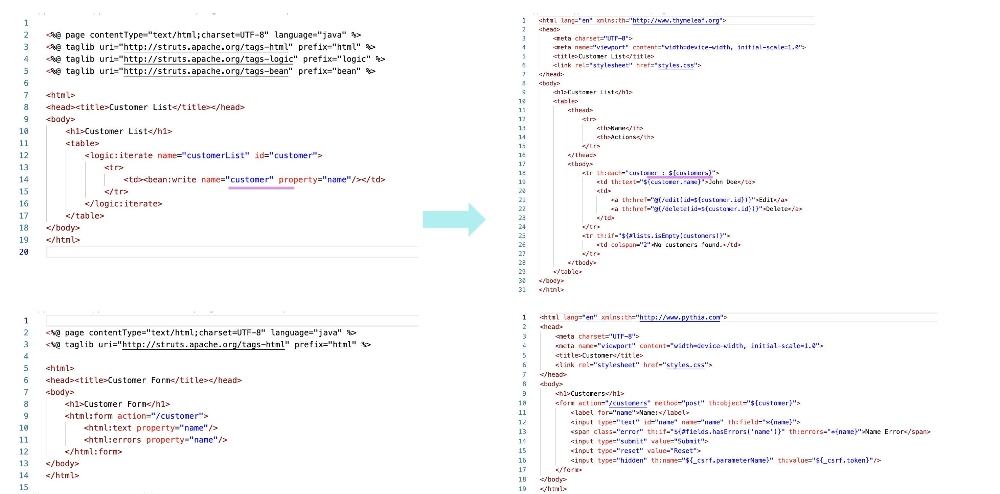
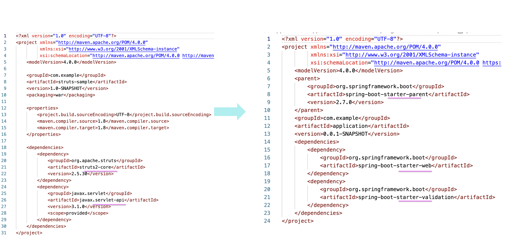

# watsonx Code Assistant - Struts to Springboot migration

Struts application can be Migrated to Springboot application using the watsonx Code Assistant (WCA). 

This feature needs to be GAed by Q2.

## Migration Process

WCA does the following steps to convert the  Struts to Springboot application.

- Analyze Java code for modernization opportunities
- Generate migration recommendations
- Transform code between different Java frameworks and specifications
- Preserve business logic while updating implementation patterns
- Convert build configurations between different build systems



## Sample Code and migrated code

The sample struts code, the converted springboot code and the logs are given for few sample applications.

<table>
    <thead>
        <th>Application</th>
        <th>Struts Code</th>
        <th>Converted springboot code</th>
        <th>Logs</th>
    </thead>
    <tr>
        <td>Sample App</td>
        <td><a href="./files/struts">Link</a></td>
        <td><a href="./files/springboot">Link</a></td>
        <td><a href="./files/logs/migration.log">Link</a></td>
   </tr>   
    <tr>
        <td>Auto Insurance</td>
        <td><a href="./files-more/auto-insurance/struts">Link</a></td>
        <td><a href="./files-more/auto-insurance/springboot">Link</a></td>
        <td><a href="./files-more/auto-insurance/logs/migration.log">Link</a></td>
   </tr> 
    <tr>
        <td>Banking</td>
        <td><a href="./files-more/banking-app/struts">Link</a></td>
        <td><a href="./files-more/banking-app/springboot">Link</a></td>
        <td><a href="./files-more/banking-app/logs/migration.log">Link</a></td>
   </tr>        
</table>


## Installation (IBMers only)

1. Clone the repository:
```bash
git clone https://github.ibm.com/watsonx-apac/wca-springboot.git
cd wca-springboot
```

2. Install dependencies:
```bash
pip install -r requirements.txt
```

3. Set up your IBM Cloud API key in `.env` file:
```bash
IAM_APIKEY=your_api_key_here
```

4. Execute the below command.

```bash
python wca_springboot.py migrate-structs ./path/to/struts/app --output ./custom/output/path
```
## Migration

Here are the code changes done by this tool.

## 1. Spring Boot Project Structure

As a first step, it creates Spring Boot project structure 

You can view the entire Spring Boot code [here](./files/springboot).




## 2. Struts Actions to Spring boot rest controller

The [CustomerAction](./files/struts/src/main/java/com/example/app/action/CustomerAction.java) from Struts is converted into [CustomerController](./files//springboot/src/main/java/com/example/application/controller/CustomerController.java)

The converted springboot controller is accessed through RESTful endpoints instead of a `method` parameter. 




The [CustomerService](./files/struts/src/main/java/com/example/app/service/CustomerService.java) from Struts is converted into service layer [CustomerService](./files//springboot/src/main/java/com/example/application/service/CustomerService.java)




## 3. Migrate Form beans and DTOs

The Struts Form/DTO is converted into Spring Boot DTO equivalent.

The [CustomerForm](./files/struts/src/main/java/com/example/app/form/CustomerForm.java) from Struts is converted into springboot [Customer](./files/springboot/src/main/java/com/example/application/model/Customer.java)



The [CustomerDTO](./files/struts/src/main/java/com/example/app/dto/CustomerDTO.java) from Struts is converted into springboot [CustomerDTO](./files/springboot/src/main/java/com/example/application/model/CustomerDTO.java)



## 4. Migrates JSP views to modern templates

The JSP pages are migrated to Thymeleaf.

[form.jsp](./files/struts/src/main/webapp/pages/customer/form.jsp) ---> [form.html](./files/springboot/src/main/resources/templates/customer/form.html)

[list.jsp](./files/struts/src/main/webapp/pages/customer/list.jsp) ---> [list.html](./files/springboot/src/main/resources/templates/customer/list.html)



## 5. Updates dependencies and configuration

pom.xml file is migrated.

[pom.xml](./files/struts/pom.xml) ---> [pom.xml](./files/springboot/pom.xml)
